# Diagrama de Clases — Arquitectura Actualizada (Lobby + Super Étendard)

Este documento describe la arquitectura definitiva del juego **1942: Super Étendard** luego de aplicar el patrón **Fachada (Adapter)** y una **Simplificación Extrema** al Core Loop del juego.

La arquitectura se caracteriza por un desacoplamiento absoluto:
1. El Lobby interactúa únicamente con la fachada `SE_ModuloEtendard`.
2. La fachada traduce los estados del Lobby e invoca al `SE_GestorPrincipal`.
3. El `SE_GestorPrincipal` funciona como un puro *Game Engine*, ajeno a las reglas de la interfaz gráfica del menú externo.
4. El sistema de Fases ha sido eliminado en favor de un diseño Arcade minimalista guiado por puntaje.

---

## 1. Diagrama de Clases Unificado (Mermaid)

```mermaid
classDiagram
  direction TB

    %% ==========================================
    %% CAPA DE ADAPTACIÓN (LOBBY <-> JUEGO)
    %% ==========================================

    class ModuloJuego {
        <<interface>>
        +getNombreModulo() String
        +getDescripcion() String
        +getNombreAvion() String
        +inicializarContexto(ContextoJuego)
        +iniciar()
        +pausar()
        +reanudar()
        +finalizar()
        +getEstado() EstadoJuego
        +getEstadisticasGenerales() EstadisticasGenerales
        +agregarObserver(IModuloObserver)
        +removerObserver(IModuloObserver)
        +actualizar(PApplet)
        +dibujar(PApplet)
    }

    class SE_ModuloEtendard {
        <<Facade / Adapter>>
        -estadoCicloVida : EstadoJuego
        -observers : List~IModuloObserver~
        -contexto : ContextoJuego
        -coreJuego : SE_GestorPrincipal
        +SE_ModuloEtendard(PApplet)
        +getNombreModulo() String
        +getDescripcion() String
        +getNombreAvion() String
        +inicializarContexto(ContextoJuego)
        +pausar()
        +reanudar()
        +finalizar()
        +getEstado() EstadoJuego
        +getEstadisticasGenerales() EstadisticasGenerales
        +agregarObserver(IModuloObserver)
        +removerObserver(IModuloObserver)
        +actualizar(PApplet)
        +dibujar(PApplet)
        +notificarDesdeCore(Tipo, String)
        -notificar(Tipo, String)
    }

    %% ==========================================
    %% CORE ENGINE (ORQUESTADOR)
    %% ==========================================

    class SE_GestorPrincipal {
        <<Core Engine>>
        +ESTADO_GAMEOVER : int = 2$
        +ESTADO_WIN : int = 3$
        #selNivel : int
        #entidades : SE_GestorDeEntidades
        #nivel : SE_GestorDeNivel
        #graficos : SE_GestorGrafico
        -historial : SE_HistorialSesion
        -inputManager : SE_InputManager
        -fachada : SE_ModuloEtendard
        -app : PApplet
        +victoriaRegistrada : boolean
        -estadoCicloVida : EstadoJuego
        +SE_GestorPrincipal(PApplet, SE_ModuloEtendard)
        +setSelNivel(int)
        +getEstadisticasGenerales(String) EstadisticasGenerales
        +isVictoriaRegistrada() boolean
        +setEstadoCicloVida(EstadoJuego)
        +getEstado() EstadoJuego
        +keyEvent(KeyEvent)
        +procesarKeyPressed(char, int)
        +procesarKeyReleased(char, int)
        +initGame()
        +registrarVictoria()
        +consolidarPartida(boolean)
        +getApp() PApplet
        +getGraficos() SE_GestorGrafico
        +getNivel() SE_GestorDeNivel
        +getHistorial() SE_HistorialSesion
        +getDificultad() int
    }

    %% ==========================================
    %% SUB-SISTEMAS (SRP)
    %% ==========================================

    class SE_GestorDeEntidades {
        +gp : SE_GestorPrincipal
        -listaNaves : ArrayList~SE_Nave~
        -listaEnemigos : ArrayList~SE_Enemigo~
        -listaProyectiles : ArrayList~SE_Proyectil~
        +SE_GestorDeEntidades(SE_GestorPrincipal)
        +vaciarTodo()
        +agregarNave(SE_Nave)
        +agregarEnemigo(SE_Enemigo)
        +agregarProyectil(SE_Proyectil)
        +vaciarEnemigos()
        +getNaves() ArrayList~SE_Nave~
        +cantEnemigos() int
        +getPrimeraNaveViva() SE_Nave
        +hayNavesVivas() boolean
        +procesar(boolean)
        ~manejarMuerteEnemigo(SE_Enemigo)
        -hayColision(SE_Objeto, SE_Objeto) boolean
    }

    class SE_GestorDeNivel {
        -tiempoNivel : int
        -bossSpawned : boolean
        -SCORE_PARA_BOSS : int
        -INTERVALO_SPAWN_BASE : int
        +SE_GestorDeNivel()
        +resetear()
        +actualizar(SE_GestorPrincipal, SE_GestorDeEntidades)
        +getTiempoNivel() int
        +isBossSpawned() boolean
    }

    class SE_GestorGrafico {
        -imagenes : HashMap~String, PImage~
        -app : PApplet
        -gp : SE_GestorPrincipal
        +SE_GestorGrafico(SE_GestorPrincipal)
        +cargarRecursos()
        +cargarImagen(String, String, int, int)
        +getImagen(String) PImage
        +dibujarConBorde(PImage, float, float, int)
        +dibujarFondo(int, int)
        +getTileImage(int) PImage
        +dibujarMenu(int)
        +dibujarUI(int)
        +dibujarPantallaPausa()
        +dibujarGameOver(String, String, int, SE_GestorPrincipal, EstadisticasGenerales)
        +renderizarSegunEstado(EstadoJuego)
    }

    class SE_InputManager {
        +SE_InputManager()
        +gestionarKeyPressed(char, int, EstadoJuego, SE_GestorPrincipal)
        +gestionarKeyReleased(char, int, EstadoJuego, SE_GestorPrincipal)
    }

    class SE_HistorialSesion {
        -registroPartidas : List~SE_EstadisticasPartida~
        -partidaActual : SE_EstadisticasPartida
        +SE_HistorialSesion()
        +iniciarNuevaPartida()
        +getPartidaActual() SE_EstadisticasPartida
        +finalizarPartidaActual(boolean, long)
        +exportarEstadisticas(String) EstadisticasGenerales
        +getRegistroPartidas() List~SE_EstadisticasPartida~
    }

    class SE_EstadisticasPartida {
        <<DTO>>
        -score : int
        -totalEnemigosDestruidos : int
        -detalleEnemigos : IntDict
        -victoria : boolean
        -tiempoJugadoSegundos : long
        +SE_EstadisticasPartida()
        +addScore(int)
        +registrarMuerte(SE_Enemigo)
        +getScore() int
        +getTotalEnemigosDestruidos() int
        +getDetalleEnemigos() IntDict
        +isVictoria() boolean
        +setVictoria(boolean)
        +getTiempoJugadoSegundos() long
        +setTiempoJugadoSegundos(long)
    }

    class EstadisticasGenerales {
        <<DTO (Lobby)>>
        -nombreModulo : String
        -partidasJugadas : int
        -partidasGanadas : int
        -puntajeTotal : int
        -enemigosDestruidos : int
        -tiempoJugadoSegundos : long
        -mejorRacha : int
        +EstadisticasGenerales(String, int, int, int, int, long, int)
        +getNombreModulo() String
        +getPartidasJugadas() int
        +getPartidasGanadas() int
        +getPuntajeTotal() int
        +getEnemigosDestruidos() int
        +getTiempoJugadoSegundos() long
        +getMejorRacha() int
    }

    %% ==========================================
    %% ENTIDADES DEL JUEGO
    %% ==========================================

    class SE_Objeto {
        <<abstract>>
        +gestor : SE_GestorDeEntidades
        +gfx : SE_GestorGrafico
        +velocidad : float
        +vivo : boolean
        +x : float
        +y : float
        +ancho : float
        +alto : float
        +SE_Objeto(SE_GestorDeEntidades, float, float)
        +actualizar() *
        +dibujar() *
        +morir()
    }

    class SE_Nave {
        +yendoDerecha : boolean
        +yendoIzquierda : boolean
        +yendoArriba : boolean
        +yendoAbajo : boolean
        +disparando : boolean
        +cooldown : int
        +SE_Nave(SE_GestorDeEntidades, float, float)
        +actualizar()
        +disparar()
        +dibujar()
    }

    class SE_Enemigo {
        <<abstract>>
        +identificadorSprite : String
        +puntajeAlMorir : int
        +isBoss : boolean
        +SE_Enemigo(SE_GestorDeEntidades, float, float, String, int, boolean)
        +actualizar() *
        +comportarseComoBuscador()
        +dibujar()
    }

    class SE_EnemigoBasico {
        +SE_EnemigoBasico(SE_GestorDeEntidades, float, float)
        +actualizar()
    }

    class SE_HmsSheffield {
        <<Boss Final>>
        -timer : int
        +SE_HmsSheffield(SE_GestorDeEntidades, float, float)
        +actualizar()
    }

    class SE_Proyectil {
        ~esAliado : boolean
        ~vx : float
        ~vy : float
        +SE_Proyectil(SE_GestorDeEntidades, float, float, boolean)
        +SE_Proyectil(SE_GestorDeEntidades, float, float, float, float, boolean)
        +actualizar()
        +dibujar()
    }

    %% ==========================================
    %% RELACIONES Y DEPENDENCIAS
    %% ==========================================

    ModuloJuego <|.. SE_ModuloEtendard : implements
    SE_ModuloEtendard *-- SE_GestorPrincipal : "encapsula y delega"

    SE_GestorPrincipal *-- SE_GestorDeEntidades
    SE_GestorPrincipal *-- SE_GestorDeNivel
    SE_GestorPrincipal *-- SE_GestorGrafico
    SE_GestorPrincipal *-- SE_InputManager
    SE_GestorPrincipal *-- SE_HistorialSesion

    SE_Objeto <|-- SE_Nave
    SE_Objeto <|-- SE_Enemigo
    SE_Objeto <|-- SE_Proyectil

    SE_Enemigo <|-- SE_EnemigoBasico
    SE_Enemigo <|-- SE_HmsSheffield

    SE_GestorDeEntidades o-- SE_Objeto : gestiona
    SE_GestorDeNivel ..> SE_EnemigoBasico : "Spawnea infinito"
    SE_GestorDeNivel ..> SE_HmsSheffield : "Spawnea al llegar a 2000pts"

    SE_HistorialSesion *-- SE_EstadisticasPartida : "registra historial"
    ModuloJuego ..> EstadisticasGenerales : "retorna"
    SE_GestorGrafico ..> EstadisticasGenerales : "renderiza GameOver"
```

---

## 2. Análisis del Diseño y Patrones Aplicados

### A. Patrón Adapter / Facade (Fachada)
* **El Problema**: Anteriormente, `SE_GestorPrincipal` estaba obligado a cumplir con los contratos del Lobby (`ModuloJuego`), incluyendo el manejo de listas de observadores y variables de estado ajenas a la lógica de un juego.
* **La Solución**: Se creó `SE_ModuloEtendard` como una Fachada. Es la única clase que implementa `ModuloJuego` y maneja toda la "burocracia" del Lobby, dejando al `SE_GestorPrincipal` completamente libre para ocuparse de la orquestación del gameplay.

### B. Simplificación Extrema del Core Loop (Arcade Puro)
Se eliminó el complejo sistema de "Fases" o "Gestión de Oleadas por arrays de tiempo":
* **`SE_GestorDeNivel`** ahora posee una lógica minimalista: Spawnea instancias de `SE_EnemigoBasico` de forma continua. Al alcanzar un puntaje objetivo (`SCORE_PARA_BOSS`), limpia la pantalla de enemigos menores y spawnea una única instancia de `SE_HmsSheffield`.

### C. Principio de Responsabilidad Única (SRP)
* **`SE_GestorGrafico`**: Solo renderiza sprites e UI. Ya no depende de conceptos lógicos temporales como la "faseActual".
* **`SE_GestorDeEntidades`**: Su responsabilidad es puramente iterar colecciones y resolver colisiones. Cuando un Boss es destruido, invoca a `gp.registrarVictoria()`.
* **`SE_InputManager`**: Reúne las lógicas de `keyPressed` y `keyReleased` adaptando la respuesta según el estado de la Fachada.

### D. Jerarquía Plana de Entidades
En contraposición al código original (que contaba con una enorme `God Class`), las entidades extienden de `SE_Objeto` y, en caso de los enemigos, de `SE_Enemigo` (que incluye el método abstracto `isBoss()`), manteniendo el polimorfismo limpio sin necesidad de usar getters de tipos tipo *String*.
