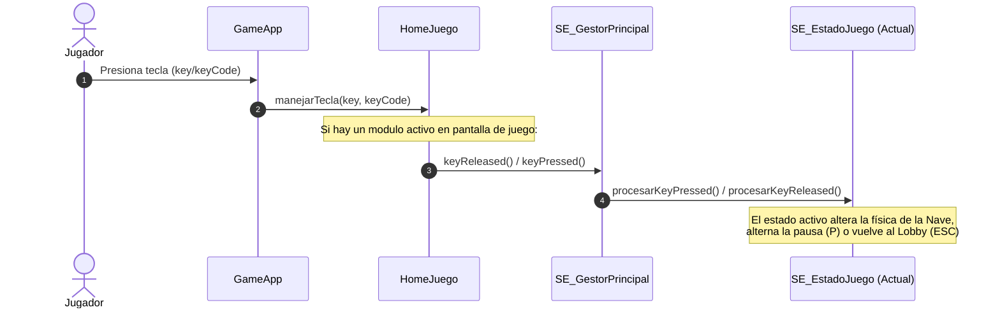
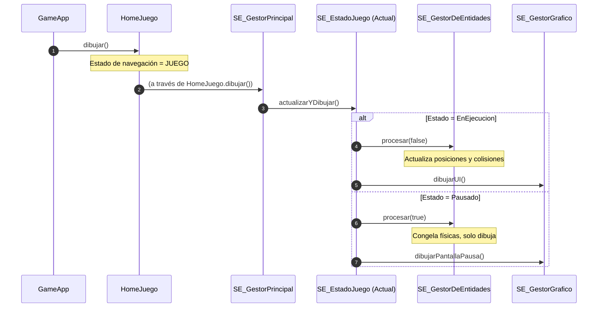

# Diagrama de Clases — Arquitectura Integrada y Aplanada (Lobby + Super Étendard)

Este documento describe la arquitectura definitiva orientada a contratos para la integración del juego **1942: Super Étendard** dentro del **Lobby Multi-Juego** de la materia.

La arquitectura se caracteriza por un desacoplamiento absoluto mediante el **Patrón Adapter (Adaptador)**, el **Patrón State (Estado)** para el ciclo de vida, el **Patrón Observer (Observador)** para notificar eventos al Lobby, y una **jerarquía aplanada** para las entidades del juego, eliminando capas abstractas y logrando código 100% Java-Processing altamente legible y mantenible.

---

## 1. Diagrama de Clases Unificado (Mermaid)

El siguiente diagrama muestra la relación exacta entre el **Lobby Principal**, los **Contratos de Integración**, el **Adaptador del Módulo del Juego**, y el **Motor Interno** del Super Étendard.

```mermaid
classDiagram
  direction TB

  %% ==========================================
  %% CAPA 1: CONTRATOS DE INTEGRACIÓN (LOBBY)
  %% ==========================================
  class ModuloJuego {
    <<interface>>
    +getNombreModulo() String
    +getDescripcion() String
    +getNombreAvion() String
    +inicializarContexto(ContextoJuego ctx) void
    +iniciar() void
    +pausar() void
    +reanudar() void
    +finalizar() void
    +getEstado() EstadoJuego
    +getEstadisticasGenerales() EstadisticasGenerales
    +agregarObserver(IModuloObserver obs) void
    +removerObserver(IModuloObserver obs) void
  }

  class EstadoJuego {
    <<interface>>
    +iniciar(ModuloJuego modulo) void
    +pausar(ModuloJuego modulo) void
    +reanudar(ModuloJuego modulo) void
    +finalizar(ModuloJuego modulo) void
    +getNombre() String
  }

  class ContextoJuego {
    -String nombreJugador
    -int anchoPantalla
    -int altoPantalla
    +ContextoJuego(String nombreJugador, int ancho, int alto)
    +getNombreJugador() String
    +getAnchoPantalla() int
    +getAltoPantalla() int
  }

  %% States concretos de Contrato
  class NoIniciadoState {
    +iniciar(ModuloJuego modulo) void
    +pausar(ModuloJuego modulo) void
    +reanudar(ModuloJuego modulo) void
    +finalizar(ModuloJuego modulo) void
    +getNombre() String
  }
  class IniciandoState {
    +iniciar(ModuloJuego modulo) void
    +pausar(ModuloJuego modulo) void
    +reanudar(ModuloJuego modulo) void
    +finalizar(ModuloJuego modulo) void
    +getNombre() String
  }
  class EnEjecucionState {
    +iniciar(ModuloJuego modulo) void
    +pausar(ModuloJuego modulo) void
    +reanudar(ModuloJuego modulo) void
    +finalizar(ModuloJuego modulo) void
    +getNombre() String
  }
  class PausadoState {
    +iniciar(ModuloJuego modulo) void
    +pausar(ModuloJuego modulo) void
    +reanudar(ModuloJuego modulo) void
    +finalizar(ModuloJuego modulo) void
    +getNombre() String
  }
  class FinalizadoState {
    +iniciar(ModuloJuego modulo) void
    +pausar(ModuloJuego modulo) void
    +reanudar(ModuloJuego modulo) void
    +finalizar(ModuloJuego modulo) void
    +getNombre() String
  }
  class ErrorState {
    +iniciar(ModuloJuego modulo) void
    +pausar(ModuloJuego modulo) void
    +reanudar(ModuloJuego modulo) void
    +finalizar(ModuloJuego modulo) void
    +getNombre() String
  }

  %% ==========================================
  %% CAPA 2: LOBBY CORE (SISTEMA MULTI-JUEGO)
  %% ==========================================
  class HomeJuego {
    -PApplet app
    -GestorModulos gestorModulos
    -GestorEstadisticas gestorEstadisticas
    -ControladorNavegacion controladorNav
    -PantallaInicio pantallaInicio
    -PantallaSeleccion pantallaSeleccion
    -PantallaEstadisticas pantallaEstadisticas
    -ModuloJuego moduloActual
    -int tiempoJuegoFrames
    +HomeJuego(PApplet app)
    +registrarModulo(ModuloJuego modulo) void
    +iniciarHome() void
    +dibujar() void
    +manejarTecla(char key, int keyCode) void
    +onModuloEvento(ModuloEvento evento) void
  }

  class IModuloObserver {
    <<interface>>
    +onModuloEvento(ModuloEvento evento) void
  }

  class ModuloEvento {
    -String moduloNombre
    -String eventoTipo
    -EstadisticasGenerales estadisticas
    +getModuloNombre() String
    +getEventoTipo() String
    +getEstadisticas() EstadisticasGenerales
  }

  class GestorModulos {
    -List~ModuloJuego~ modulos
    +agregarModulo(ModuloJuego m) void
    +listarModulos() List~ModuloJuego~
    +obtenerModulo(int index) ModuloJuego
  }

  class GestorEstadisticas {
    -RepositorioEstadisticas repositorio
    +GestorEstadisticas(RepositorioEstadisticas repo)
    +guardarEstadisticas(EstadisticasGenerales stats) void
    +obtenerHistorial() List~EstadisticasGenerales~
  }

  class RepositorioEstadisticas {
    <<interface>>
    +guardar(EstadisticasGenerales stats) void
    +cargarTodas() List~EstadisticasGenerales~
  }

  class RepositorioEstadisticasArchivo {
    -String rutaDirectorio
    +RepositorioEstadisticasArchivo(String ruta)
    +guardar(EstadisticasGenerales stats) void
    +cargarTodas() List~EstadisticasGenerales~
  }

  class ControladorNavegacion {
    -Pantalla pantallaActual
    +ControladorNavegacion()
    +irHome() void
    +irSeleccionModulo() void
    +irEstadisticas() void
    +iniciarModulo(ModuloJuego modulo) void
    +getPantallaActual() Pantalla
  }

  class Pantalla {
    <<enumeration>>
    INICIO
    SELECCION
    ESTADISTICAS
    JUEGO
  }

  class EstadisticasGenerales {
    -String nombreModulo
    -int puntajeTotal
    -int partidasJugadas
    -int partidasGanadas
    -int partidasPerdidas
    -int recordEnemigosDestruidos
    -long tiempoTotalJugadoSegundos
    +EstadisticasGenerales(...)
    +getNombreModulo() String
    +getPuntajeTotal() int
    +getPartidasJugadas() int
    +getPartidasGanadas() int
    +getPartidasPerdidas() int
    +getRecordEnemigosDestruidos() int
    +getTiempoTotalJugadoSegundos() long
  }

  %% ==========================================
  %% CAPA 3: ADAPTADOR Y CONTROL INTERNO DEL JUEGO
  %% ==========================================
  class SE_GestorPrincipal {
    +static int ESTADO_GAMEOVER
    +static int ESTADO_WIN
    +static int FASE_INICIO
    +static int FASE_MEDIO
    +static int FASE_FINAL
    #int selNivel
    #SE_GestorDeEntidades entidades
    #SE_GestorDeNivel nivel
    #SE_GestorGrafico graficos
    +EstadisticasGenerales statsGenerales
    -SE_HistorialSesion historial
    -SE_InputManager inputManager
    -ContextoJuego contexto
    -List~IModuloObserver~ observers
    -EstadoJuego estadoCicloVida
    -PApplet app
    +SE_GestorPrincipal(PApplet app)
    +void setSelNivel(int n)
    +void initGame()
    +void ganarPartida()
    +void perderPartida()
    +void volverAlLobby()
    +void volverAlMenu()
    +void actualizarYDibujar()
    +void procesarKeyPressed(char k, int kCode)
    +void procesarKeyReleased(char k, int kCode)
  }


  class SE_EstadisticasPartida {
    -int score
    -int totalEnemigosDestruidos
    -IntDict detalleEnemigos
    -boolean victoria
    -long tiempoJugadoSegundos
    +SE_EstadisticasPartida()
    +addScore(int puntos) void
    +registrarMuerte(SE_Enemigo e) void
    +getScore() int
    +getTotalEnemigosDestruidos() int
    +getDetalleEnemigos() IntDict
    +isVictoria() boolean
    +setVictoria(boolean vic) void
    +getTiempoJugadoSegundos() long
    +setTiempoJugadoSegundos(long seg) void
  }

  %% ==========================================
  %% CAPA 4: ENTIDADES Y RENDERIZADO DEL JUEGO
  %% ==========================================
  class SE_GestorDeEntidades {
    +SE_GestorPrincipal gp
    -ArrayList~SE_Nave~ listaNaves
    -ArrayList~SE_Enemigo~ listaEnemigos
    -ArrayList~SE_Proyectil~ listaProyectiles
    -ArrayList~SE_Mejora~ listaMejoras
    -ArrayList~SE_Enemigo~ escuadronRojoActivo
    +SE_GestorDeEntidades(SE_GestorPrincipal gp)
    +vaciarTodo() void
    +agregarNave(SE_Nave n) void
    +agregarEnemigo(SE_Enemigo e) void
    +agregarProyectil(SE_Proyectil p) void
    +agregarEscuadronRojo(SE_Enemigo e) void
    +vaciarEnemigos() void
    +getNaves() ArrayList~SE_Nave~
    +cantEnemigos() int
    +hayEscuadronRojo() boolean
    +getPrimeraNaveViva() SE_Nave
    +hayNavesVivas() boolean
    +procesar(boolean pausado) void
  }

  class SE_GestorDeNivel {
    -int tiempoNivel
    -int pausaPeligroTimer
    -int faseActual
    -boolean bossSpawned
    +SE_GestorDeNivel()
    +resetear() void
    +actualizar(SE_GestorPrincipal sesion, SE_GestorDeEntidades entidades) void
    +getTiempoNivel() int
    +getFaseActual() int
    +isBossSpawned() boolean
    +getPausaPeligroTimer() int
    +setPausaPeligroTimer(int t) void
    +marcarBossSpawned() void
  }

  class SE_GestorGrafico {
    -SE_GestorPrincipal gp
    -HashMap~String,PImage~ imagenes
    +SE_GestorGrafico(SE_GestorPrincipal gp)
    +getImagen(String key) PImage
    +cargarImagen(String id, String path, float w, float h) void
    +dibujarFondo(int tiempo, int nivel, int fase) void
    +dibujarMenu(int cantJugadores, int nivel) void
    +dibujarUI(int score, int fase) void
    +dibujarPantallaPausa() void
    +dibujarGameOver(String tit, String sub, int est, SE_GestorPrincipal gp, EstadisticasGenerales stats) void
    +dibujarConBorde(PImage sprite, float dx, float dy, int bordeCol) void
  }

  class SE_Objeto {
    #SE_GestorDeEntidades gestor
    #SE_GestorGrafico gfx
    #float x
    #float y
    #float velocidad
    #boolean vivo
    #float ancho
    #float alto
    +SE_Objeto(SE_GestorDeEntidades gestor, float x, float y)
    +actualizar() void
    +dibujar() void
    +getAncho() float
    +getAlto() float
    +getX() float
    +getY() float
    +isVivo() boolean
    +morir() void
  }

  class SE_Nave {
    #boolean yendoDerecha
    #boolean yendoIzquierda
    #boolean yendoArriba
    #boolean yendoAbajo
    #float powerUpTimer
    #boolean isDoubleShot
    #boolean disparando
    #int cooldown
    +SE_Nave(SE_GestorDeEntidades gestor, float x, float y)
    +activarMejora() void
    +hasDoubleShot() boolean
    +setDisparando(boolean v) void
    +setYendoDerecha(boolean v) void
    +setYendoIzquierda(boolean v) void
    +setYendoArriba(boolean v) void
    +setYendoAbajo(boolean v) void
    +disparar() void
  }

  class SE_Enemigo {
    ~String tipo
    ~int timer
    ~float t
    ~int estado
    ~float startX
    ~float dirX
    ~boolean puedeDisparar
    ~int shootCooldown
    ~int hp
    +SE_Enemigo(SE_GestorDeEntidades gestor, float x, float y, String tipo)
    +getTipo() String
    +recibirDano() void
    +soltarMejora() SE_Mejora
    +disparar() void
    +colisionaConNave() boolean
  }

  class SE_Proyectil {
    ~boolean esAliado
    ~float vx
    ~float vy
    +SE_Proyectil(SE_GestorDeEntidades gestor, float x, float y, boolean esAliado)
    +SE_Proyectil(SE_GestorDeEntidades gestor, float x, float y, float vx, float vy, boolean esAliado)
  }

  class SE_Mejora {
    -int tipo
    +SE_Mejora(SE_GestorDeEntidades gestor, float x, float y, int tipo)
    +getTipo() int
  }

  class SE_HistorialSesion {
    -List~SE_EstadisticasPartida~ registroPartidas
    -SE_EstadisticasPartida partidaActual
    +SE_HistorialSesion()
    +void iniciarNuevaPartida()
    +SE_EstadisticasPartida getPartidaActual()
    +void finalizarPartidaActual(boolean gano, long tiempoJugadoSegundos)
    +EstadisticasGenerales exportarEstadisticas(String nombreModulo)
    +List~SE_EstadisticasPartida~ getRegistroPartidas()
  }

  class SE_InputManager {
    +SE_InputManager()
    +void gestionarKeyPressed(char k, int kCode, EstadoJuego estadoActual, SE_GestorPrincipal gp)
    +void gestionarKeyReleased(char k, int kCode, EstadoJuego estadoActual, SE_GestorPrincipal gp)
  }

  %% ==========================================
  %% RELACIONES Y ACOPLAMIENTOS
  %% ==========================================

  %% Implementación de Interfaces de Contrato
  HomeJuego ..|> IModuloObserver
  SE_GestorPrincipal ..|> ModuloJuego
  NoIniciadoState ..|> EstadoJuego
  IniciandoState ..|> EstadoJuego
  EnEjecucionState ..|> EstadoJuego
  PausadoState ..|> EstadoJuego
  FinalizadoState ..|> EstadoJuego
  ErrorState ..|> EstadoJuego

  %% Composición y Agregación del Lobby Core
  HomeJuego *-- GestorModulos
  HomeJuego *-- GestorEstadisticas
  HomeJuego *-- ControladorNavegacion
  GestorModulos o-- ModuloJuego : administra
  GestorEstadisticas o-- RepositorioEstadisticas
  RepositorioEstadisticasArchivo ..|> RepositorioEstadisticas
  ControladorNavegacion --> Pantalla : navega
  HomeJuego --> ModuloJuego : activa actual
  HomeJuego ..> ModuloEvento : escucha
  ModuloJuego ..> IModuloObserver : dispara eventos a
  ModuloJuego --> EstadoJuego : expone estado de contrato
  ModuloJuego ..> ContextoJuego : se configura con
  ModuloJuego ..> EstadisticasGenerales : genera reporte

  %% Estructura Interna del Módulo Adaptado (Super Étendard)
  SE_GestorPrincipal *-- SE_GestorDeEntidades
  SE_GestorPrincipal *-- SE_GestorDeNivel
  SE_GestorPrincipal *-- SE_GestorGrafico
  SE_GestorPrincipal *-- SE_HistorialSesion : acumula estadísticas a largo plazo
  SE_GestorPrincipal *-- SE_InputManager : delega control de teclado
  SE_HistorialSesion *-- SE_EstadisticasPartida : gestiona histórico e intento activo

  %% Jerarquía Aplanada de Actores (Herencia Directa Concreta)
  SE_Nave --|> SE_Objeto
  SE_Enemigo --|> SE_Objeto
  SE_Proyectil --|> SE_Objeto
  SE_Mejora --|> SE_Objeto

  %% Asociaciones y Flujo de Control en Gameplay
  SE_GestorDeEntidades o-- SE_Nave
  SE_GestorDeEntidades o-- SE_Enemigo
  SE_GestorDeEntidades o-- SE_Proyectil
  SE_GestorDeEntidades o-- SE_Mejora

  SE_GestorDeOleadas ..> SE_Enemigo : genera oleadas de
  SE_Enemigo ..> SE_Mejora : suelta al morir
  SE_Nave ..> SE_Proyectil : dispara proyectil aliado
  SE_Enemigo ..> SE_Proyectil : dispara proyectil enemigo
  SE_Objeto o-- SE_GestorDeEntidades : interactúa con
  SE_Objeto o-- SE_GestorGrafico : solicita sprites a
```



---

## 2. Análisis del Diseño y Patrones Aplicados

### A. Patrón Adapter (Adaptador)
El lobby define la interfaz `Contrato.ModuloJuego` y espera comunicarse de manera uniforme con cualquier juego de aviones desarrollado por la clase.
* **El Objetivo**: Adaptar un juego interactivo de Processing (Super Étendard) que cuenta con sus propios estados internos, teclado, render y ciclo de juego, para que actúe como un plugin limpio.
* **La Solución**: `SE_GestorPrincipal` es el adaptador. Implementa `ModuloJuego` y traduce los comandos del Lobby (`iniciar()`, `pausar()`, `finalizar()`) al flujo interno del motor de juego, y expone las estadísticas de la sesión en el formato `EstadisticasGenerales`.

### B. Patrón State (Estado) Doble
Para lograr un desacoplamiento robusto y evitar grandes bloques condicionales (`if/else` o `switch`), el proyecto utiliza dos implementaciones del Patrón State en niveles diferentes:

1. **Estado del Contrato (Lobby)**:
   * Representado por la interfaz `Contrato.EstadoJuego` y sus clases concretas (`EnEjecucionState`, `PausadoState`, `FinalizadoState`, etc.).
   * Administra la lógica global requerida por el Lobby Multi-Juego.
   * `SE_GestorPrincipal.getEstado()` mapea dinámicamente sus estados de juego internos a estas instancias para reportar al Lobby en qué estado se encuentra el módulo en cada instante.
   
2. **Estado del Motor de Juego (Super Étendard)**:
   * Representado por la clase abstracta `SE_EstadoJuego` y sus subclases (`SE_NoIniciado`, `SE_EnEjecucionState`, `SE_PausadoState`, `SE_FinalizadoState`).
   * Maneja el bucle de renderizado (`actualizarYDibujar()`), la máquina de estados de gameplay, y **rutea las pulsaciones de teclado** (`procesarKeyPressed()`, `procesarKeyReleased()`) según corresponda (por ejemplo: la selección de nivel y jugadores en `SE_NoIniciado`, el control de naves y el botón `P` de pausa en `SE_EnEjecucionState`, y el reinicio o salida con `ESC` en `SE_FinalizadoState`).

### C. Patrón Observer (Observador)
La comunicación ascendente desde el juego hacia el Lobby (por ejemplo, notificar cuando se completa una partida o cuando se vuelve al menú principal) se realiza mediante eventos asíncronos.
* `SE_GestorPrincipal` mantiene una lista de observadores `List<IModuloObserver>`.
* `HomeJuego` se registra como observador del módulo al iniciarlo.
* Al finalizar el juego (Victoria o Derrota), `SE_GestorPrincipal` dispara un `ModuloEvento` con los detalles y estadísticas recolectadas para que el Lobby actualice el repositorio persistente de manera automática.

### D. Jerarquía Aplanada de Entidades
En lugar de poseer múltiples capas de herencia abstracta complejas (como `Vehiculo`, `ObjetoVolador`, etc.), el motor del juego usa una estructura de herencia aplanada:
* `SE_Objeto` es una clase concreta de utilidad que encapsula coordenadas físicas (`x`, `y`), velocidades, dimensiones (`ancho`, `alto`), y el ciclo básico de vida de cualquier entidad en pantalla (`vivo`, `morir()`).
* Las subclases (`SE_Nave`, `SE_Enemigo`, `SE_Proyectil`, `SE_Mejora`) heredan directamente de `SE_Objeto` e implementan sus propias lógicas específicas, reduciendo la redundancia de código y optimizando las colisiones a través de un único despachador (`SE_GestorDeEntidades`).

---

## 3. Resumen de Flujos Principales

### Entrada y Control de Teclado


### Bucle de Simulación y Dibujo


### Acción de Disparar (Nave del Jugador y Enemigos)

El disparo cuenta con dos flujos independientes: el **disparo de la nave del jugador** (iniciado por el teclado) y el **disparo de los enemigos** (autónomo y guiado por temporizadores internos).

#### 1. Disparo de la Nave (Jugador)

```mermaid
sequenceDiagram
  autonumber
  actor Jugador
  participant GameApp
  participant HomeJuego
  participant SE_EnEjecucionState
  participant SE_Nave
  participant SE_GestorDeEntidades
  participant SE_Proyectil

  %% Paso 1: Presión de Teclado
  Jugador->>GameApp: Presiona Barra Espaciadora / F
  GameApp->>HomeJuego: manejarTecla(key, keyCode)
  HomeJuego->>SE_EnEjecucionState: procesarKeyPressed(key, keyCode)
  SE_EnEjecucionState->>SE_Nave: setDisparando(true)

  %% Paso 2: Bucle de Actualización
  Note over SE_EnEjecucionState: En el ciclo de actualización de frames (draw):
  SE_EnEjecucionState->>SE_GestorDeEntidades: procesar(false)
  SE_GestorDeEntidades->>SE_Nave: actualizar()
  
  Note over SE_Nave: decrementa cooldown
  SE_Nave->>SE_Nave: disparar()
  
  alt disparando == true && cooldown == 0
    Note over SE_Nave: cooldown = 10
    create participant SE_Proyectil
    SE_Nave->>SE_Proyectil: new SE_Proyectil(gestor, x, y, esAliado=true)
    SE_Nave->>SE_GestorDeEntidades: agregarProyectil(proyectil)
  end

  %% Paso 3: Liberación de Teclado
  Jugador->>GameApp: Suelta Barra Espaciadora / F
  GameApp->>HomeJuego: (eventos de keyReleased)
  HomeJuego->>SE_EnEjecucionState: procesarKeyReleased(key, keyCode)
  SE_EnEjecucionState->>SE_Nave: setDisparando(false)
```

#### 2. Disparo de Enemigos (Autónomo)

```mermaid
sequenceDiagram
  autonumber
  participant SE_EnEjecucionState
  participant SE_GestorDeEntidades
  participant SE_Enemigo
  participant SE_Nave
  participant SE_Proyectil

  Note over SE_EnEjecucionState: En el ciclo de actualización de frames (draw):
  SE_EnEjecucionState->>SE_GestorDeEntidades: procesar(false)
  SE_GestorDeEntidades->>SE_Enemigo: actualizar()
  SE_GestorDeEntidades->>SE_Enemigo: disparar()

  alt y > 0 && y < alto/2 && shootCooldown <= 0
    Note over SE_Enemigo: shootCooldown = 150 + random(60)
    SE_Enemigo->>SE_GestorDeEntidades: getNaves()
    SE_GestorDeEntidades-->>SE_Enemigo: lista de naves activas
    Note over SE_Enemigo: Busca primera Nave viva como objetivo
    
    alt Nave objetivo encontrada
      Note over SE_Enemigo: Calcula ángulo hacia Nave: atan2(dy, dx)
      create participant SE_Proyectil
      SE_Enemigo->>SE_Proyectil: new SE_Proyectil(gestor, x, y, vx, vy, esAliado=false)
    else No hay naves vivas
      create participant SE_Proyectil
      SE_Enemigo->>SE_Proyectil: new SE_Proyectil(gestor, x, y, vx=0, vy=5, esAliado=false)
    end
    SE_Enemigo->>SE_GestorDeEntidades: agregarProyectil(proyectil)
  else shootCooldown > 0
    Note over SE_Enemigo: decrementa shootCooldown
  end
```

